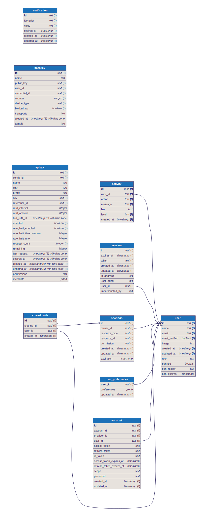

# 🚗 Opendrive

**A modern, self-hosted cloud storage solution with mobile and web clients**

Opendrive is a comprehensive file storage and synchronization platform that provides you with complete control over your data. Built with modern technologies and designed for both individual users and organizations who want the convenience of cloud storage without sacrificing privacy and control.


## ✨ Features

- **🌐 Web Interface**: Modern, responsive web application built with SvelteKit
- **� Mobile App**: Native mobile experience with Expo/React Native
- **🔐 Authentication**: Secure authentication via Better Auth with OAuth providers
- **📂 File Management**: Upload, download, organize files and folders
- **🏷️ Smart Categories**: Automatic categorization of files (images, documents, music, etc.)
- **🗑️ Soft Trash**: Recoverable file deletion with trash support
- **🔒 Self-Hosted**: Complete control over your data and infrastructure
- **🐳 Docker Support**: Easy deployment with Docker Compose
- **📊 Recent Files**: Quick access to recently modified files

## 🏗️ Architecture

Opendrive is a **monorepo** with the following packages:

```
packages/
├── web/     # SvelteKit app (frontend + Hono API backend)
└── mobile/  # Expo/React Native mobile app
```

### Database


### Web Package (`packages/web`)

The web package is a full-stack SvelteKit application:

- **Frontend**: SvelteKit with Svelte 5, TailwindCSS, and shadcn-svelte components
- **Backend API**: Hono routers integrated into SvelteKit server routes
- **Database**: PostgreSQL with Drizzle ORM (user accounts, activity logging)
- **Storage**: Local filesystem storage under `STORAGE_PATH` (default `/data`)
- **Auth**: Better Auth for authentication

### Mobile Package (`packages/mobile`)

- **Framework**: Expo with React Native
- **Styling**: NativeWind (TailwindCSS for React Native)
- **Routing**: Expo Router (file-based routing)

## 🚀 Quick Start

### Prerequisites

- **Bun 1.3+** (primary runtime)
- **Docker and Docker Compose** (for PostgreSQL)
- **Node.js** (for Expo/mobile development)

### Development Setup

1. **Clone the repository**

    ```bash
    git clone https://github.com/boyer-nicolas/opendrive.git
    cd opendrive
    ```

2. **Install dependencies**

    ```bash
    bun install
    ```

3. **Start development services**

    ```bash
    bun run dev
    ```

    This starts PostgreSQL via Docker Compose and the Vite dev server for the web app.

4. **Access the application**
    - Web UI: http://localhost:5173 (Vite default)

### Mobile Development

```bash
cd packages/mobile
npm install
npx expo start
```

> **Note**: When connecting to the web API from a device/emulator, don't use `localhost`:
> - **iOS Simulator**: Use your host machine IP (e.g., `http://192.168.x.x:3000`)
> - **Android Emulator**: Use `http://10.0.2.2:3000` or set up `adb reverse`

## 🐳 Docker Deployment

Build and run the production container:

```bash
docker compose up --build
```

The app will be available at http://localhost:3000.

### Environment Variables

See [.example.env](.example.env) for a complete reference.

#### Core

| Variable | Description | Default |
|----------|-------------|---------|
| `APP_ENV` | Environment (`dev`/`production`) | `production` |
| `ORIGIN` | Public origin URL (used for OAuth callbacks) | `http://localhost:3000` |
| `LOG_LEVEL` | `debug`, `info`, `warn`, `error` | `info` |
| `LOG_FORMAT` | `console` or `json` | `console` |

#### Database

| Variable | Description | Default |
|----------|-------------|---------|
| `DATABASE_URL` | PostgreSQL connection string | Required |

#### Authentication

| Variable | Description | Default |
|----------|-------------|---------|
| `AUTH_SECRET` | Secret key for signing auth tokens | Required |
| `ENABLE_EMAIL_SIGNIN` | Enable email/password sign-in | `true` |
| `ENABLE_OAUTH_SIGNIN` | Enable OAuth sign-in | `false` |
| `MIN_PASSWORD_LENGTH` | Minimum password length | `8` |

#### OAuth Providers (Optional)

Configure OAuth providers using the pattern `OAUTH_<PROVIDER>_<SETTING>`:

| Variable | Description | Default |
|----------|-------------|---------|
| `OAUTH_<PROVIDER>_ENABLED` | Enable this provider | `true` |
| `OAUTH_<PROVIDER>_CLIENT_ID` | OAuth client ID | Required |
| `OAUTH_<PROVIDER>_CLIENT_SECRET` | OAuth client secret | Required |
| `OAUTH_<PROVIDER>_DISCOVERY_URL` | OIDC discovery URL | Required |
| `OAUTH_<PROVIDER>_PRETTY_NAME` | Display name | Provider name |
| `OAUTH_<PROVIDER>_PKCE` | Use PKCE | `true` |
| `OAUTH_<PROVIDER>_SCOPES` | Comma-separated scopes | `openid,profile,email` |

#### SMTP (Optional)

| Variable | Description | Default |
|----------|-------------|---------|
| `SMTP_ENABLED` | Enable SMTP | `false` |
| `SMTP_HOST` | SMTP server hostname | Required if enabled |
| `SMTP_PORT` | SMTP server port | `587` |
| `SMTP_USER` | SMTP username | Required if enabled |
| `SMTP_PASSWORD` | SMTP password | Required if enabled |
| `SMTP_FROM` | Sender email address | Required if enabled |
| `SMTP_SECURE` | Use TLS (`true`/`false`) | `false` |

## 🛠️ Development

### Tech Stack

- **Runtime**: Bun
- **Web Framework**: SvelteKit + Hono
- **Frontend**: Svelte 5, TailwindCSS 4, shadcn-svelte
- **Mobile**: Expo, React Native, NativeWind
- **Database**: PostgreSQL, Drizzle ORM
- **Auth**: Better Auth
- **Linting**: Biome

### Available Commands

```bash
# Root commands
bun run dev          # Start dev servers (DB + web)
bun run test         # Run tests
bun run build        # Build all packages
bun run lint         # Lint with Biome
bun run lint:fix     # Lint and fix issues
bun run check        # Type-check all packages

# Web package (packages/web)
bun run dev          # Start Vite dev server
bun run build        # Build for production
bun run check        # Type-check with svelte-check
bun run db:generate  # Generate Drizzle migrations

# Mobile package (packages/mobile)
npx expo start       # Start Expo dev server
npm run android      # Run on Android
npm run ios          # Run on iOS
```

## 📄 License

This project is licensed under the MIT License - see the [LICENSE](LICENSE) file for details.

## 🙏 Acknowledgments

Built with these open-source technologies:

- [SvelteKit](https://kit.svelte.dev/) - Full-stack web framework
- [Hono](https://hono.dev/) - Lightweight web framework for API routes
- [shadcn-svelte](https://shadcn-svelte.com/) - UI components
- [Bun](https://bun.sh/) - JavaScript runtime and toolkit
- [Expo](https://expo.dev/) - React Native framework
- [Drizzle ORM](https://orm.drizzle.team/) - TypeScript ORM
- [Better Auth](https://www.better-auth.com/) - Authentication library
- [PostgreSQL](https://postgresql.org/) - Database
- [Biome](https://biomejs.dev/) - Linter and formatter

## 🆘 Support

- 🐛 [Issue Tracker](https://github.com/boyer-nicolas/opendrive/issues)
- 💬 [Discussions](https://github.com/boyer-nicolas/opendrive/discussions)
