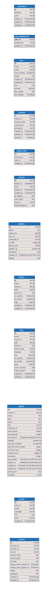

# Penombre

A modern, self-hosted cloud storage solution with mobile and web clients.

Penombre is a comprehensive file storage and synchronization platform that
provides you with complete control over your data. Built with modern
technologies and designed for both individual users and organizations who want
the convenience of cloud storage without sacrificing privacy and control.


## Getting Started

Follow the [installation guide](https://penombre.space/docs) to set up your
Penombre instance in minutes. For configuration options, see the
[environment variables documentation](https://penombre.space/docs/env).

## Features

- **Web Interface**: Modern, responsive web application built with SvelteKit
- **Mobile App**: Native mobile experience with Expo/React Native
- **Authentication**: Secure authentication via Better Auth with OAuth providers
- **File Management**: Upload, download, organize files and folders
- **Smart Categories**: Automatic categorization of files (images, documents,
  music, etc.)
- **Soft Trash**: Recoverable file deletion with trash support
- **Self-Hosted**: Complete control over your data and infrastructure
- **Docker Support**: Easy deployment with Docker Compose
- **Recent Files**: Quick access to recently modified files

### Environment Variables

See [the docs](https://penombre.space/docs/env) for a complete reference.

## Architecture

The SvelteKit app is the repo itself: it lives at the root, and the secondary
clients live under `packages/`.

```text
.                  # SvelteKit app (frontend + backend API)
├── src/
├── e2e/
├── drizzle/
└── packages/
    ├── mobile/    # Expo/React Native mobile app
    └── docs/      # Documentation site (SvelteKit, @orochibraru/docs)
```

### Database



### Web App (repo root)

The root of the repo is a full-stack SvelteKit application:

- **Frontend**: SvelteKit with Svelte 5, TailwindCSS, and shadcn-svelte
  components
- **Backend API**: Hono routers integrated into SvelteKit server routes
- **Database**: PostgreSQL with Drizzle ORM (user accounts, activity logging)
- **Storage**: Local filesystem storage under `STORAGE_PATH` (default `/data`)
- **Auth**: Better Auth for authentication

### Mobile Package (`packages/mobile`)

- **Framework**: Expo with React Native
- **Styling**: NativeWind (TailwindCSS for React Native)
- **Routing**: Expo Router (file-based routing)

## Development

### Prerequisites

- **Bun 1.3+** (primary runtime)
- **Docker and Docker Compose** (for PostgreSQL)
- **Node.js** (for Expo/mobile development)

### Setup

1. **Clone the repository**

   ```bash
   git clone https://github.com/orochibraru/penombre.git
   cd penombre
   ```

2. **Install dependencies**

   ```bash
   bun install
   ```

3. **Start development services**

   ```bash
   bun run dev
   ```

   This starts PostgreSQL via Docker Compose and the Vite dev server for the web
   app. Use `bun run dev:app` for the Vite server alone.

4. **Access the application**
   - Web UI: <http://localhost:5173> (Vite default)

### Mobile Development

```bash
cd packages/mobile
bun install
bunx expo start
```

> **Note**: When connecting to the web API from a device/emulator, don't use
> `localhost`:
>
> - **iOS Simulator**: Use your host machine IP (e.g.,
>   `http://192.168.x.x:3000`)
> - **Android Emulator**: Use `http://10.0.2.2:3000` or set up `adb reverse`

## Docker Deployment

Build and run the production container:

```bash
docker compose up --build
```

The app will be available at <http://localhost:3000>.

## Backup & Restore

Penombre includes backup and restore scripts to protect your data. Backups
include both the PostgreSQL database and all file storage.

### Creating a Backup

```bash
# With the stack running:
bun run backup

# Or specify a custom backup directory:
./scripts/backup.sh /path/to/backups
```

This creates a timestamped archive containing:

- **database.dump** - PostgreSQL custom format dump
- **storage.tar.gz** - All uploaded files and metadata
- **backup.json** - Backup metadata

### Restoring from Backup

```bash
# With the stack running:
bun run restore ./backups/penombre_backup_20240115_120000.tar.gz

# Or directly:
./scripts/restore.sh ./backups/penombre_backup_20240115_120000.tar.gz
```

> **Warning**: Restore will **replace all existing data**. Make sure you have a
> backup of current data before restoring.

### Automated Backups

For automated backups, add a cron job:

```bash
# Daily backup at 2 AM
0 2 * * * cd /path/to/penombre && ./scripts/backup.sh /path/to/backups >> /var/log/penombre-backup.log 2>&1
```

### Backup Storage Recommendations

- Store backups on a different drive or remote storage
- Keep multiple backup generations (e.g., last 7 days)
- Test restores periodically to verify backup integrity

## Tooling

### Tech Stack

- **Runtime**: Bun
- **Web Framework**: SvelteKit + Hono
- **Frontend**: Svelte 5, TailwindCSS 4, shadcn-svelte
- **Mobile**: Expo, React Native, NativeWind
- **Database**: PostgreSQL, Drizzle ORM
- **Auth**: Better Auth
- **Linting**: Biome (TS/JS/CSS/Svelte), markdownlint + Prettier (Markdown),
  tailwint (Tailwind class order)
- **Git hooks**: [prek](https://github.com/j178/prek) via
  `.pre-commit-config.yaml`

### Git hooks

`bun install` runs `prek install`, which wires `.pre-commit-config.yaml` into
`.git/hooks`. The same config runs in CI, so a green local commit is a green CI
lint job. Install prek with `brew install prek` (or see its README); the
`prepare` script is a no-op without it.

```bash
prek run --all-files   # run every hook over the whole repo
prek run biome         # run a single hook
SKIP=test-unit git commit ...   # skip a hook for one commit
```

### Available Commands

```bash
# App
bun run dev          # Start dev stack (Docker Compose + Vite)
bun run dev:app      # Start the Vite dev server alone
bun run build        # Build for production
bun run preview      # Preview the production build
bun run db:generate  # Generate Drizzle migrations
bun run db:studio    # Open Drizzle Studio

# Quality
bun run lint         # biome + markdownlint + tailwint
bun run lint:fix     # ...and fix what is fixable
bun run format       # biome format --write
bun run check        # Type-check app, scripts, docs and mobile
bun run check:app    # svelte-check on the app alone

# Tests
bun test                # Unit tests (fully mocked, no services needed)
bun run test:docker     # Unit tests in Docker (simulates CI w/ Redis)
bun run test:e2e:local  # E2E, local filesystem backend (no S3 required)
bun run test:e2e:s3     # E2E, S3/Garage backend

# Codegen
bun run gen:api      # OpenAPI spec + typed clients (web + mobile)
bun run gen:env      # Regenerate .example.env
bun run db:diagram   # Regenerate resources/db.svg

# Mobile package (packages/mobile)
bunx expo start       # Start Expo dev server
bunx expo run:android # Run on Android
bunx expo run:ios     # Run on iOS
```

## License

This project is licensed under the MIT License - see the [LICENSE](LICENSE) file
for details.

## Acknowledgments

Built with these open-source technologies:

- [SvelteKit](https://kit.svelte.dev/) - Full-stack web framework
- [shadcn-svelte](https://shadcn-svelte.com/) - UI components
- [Bun](https://bun.sh/) - JavaScript runtime and toolkit
- [Expo](https://expo.dev/) - React Native framework
- [Drizzle ORM](https://orm.drizzle.team/) - TypeScript ORM
- [Better Auth](https://www.better-auth.com/) - Authentication library
- [PostgreSQL](https://postgresql.org/) - Database
- [Biome](https://biomejs.dev/) - Linter and formatter
