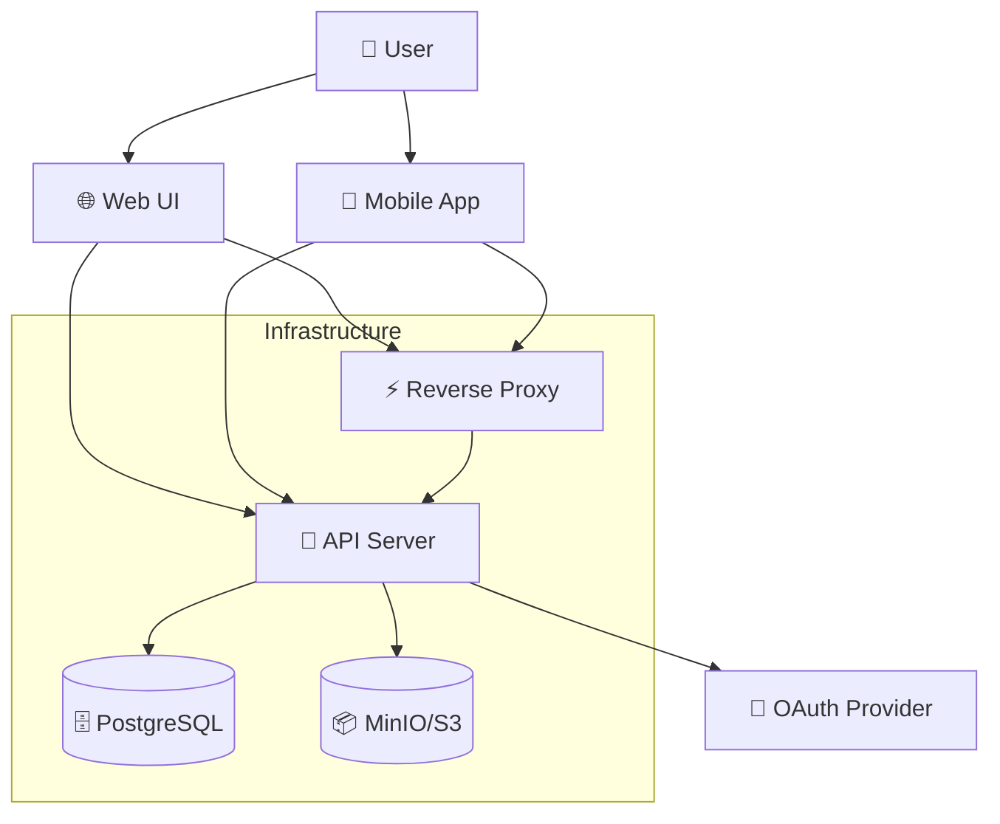
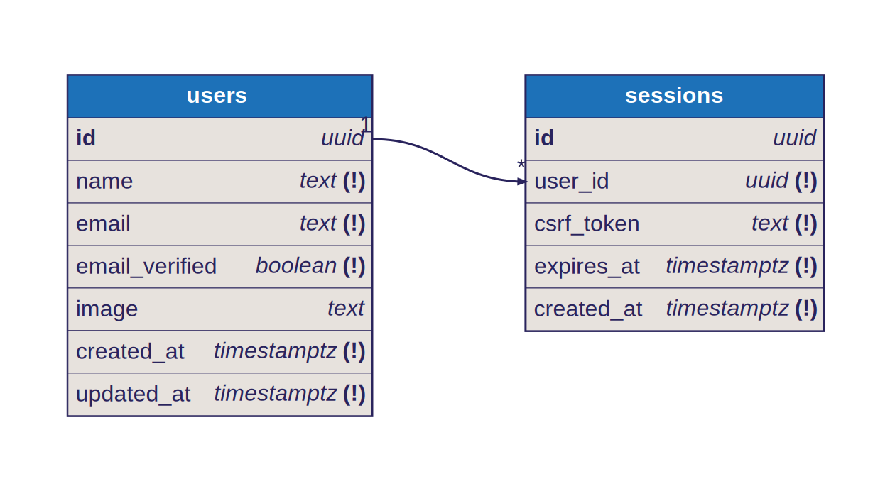

# Architecture

Opendrive is built using a modern microservices architecture that prioritizes scalability, maintainability, and developer experience. This document outlines the system design, technology choices, and how different components interact.

## System Overview



## Components

### 1. API Server (Go)

**Location**: `packages/api/`

The core backend service written in Go, providing:

#### Technology Stack

- **Runtime**: Go 1.24+
- **HTTP Router**: [Chi](https://go-chi.io/) - Lightweight, fast HTTP router
- **Database**: [SQLC](https://sqlc.dev/) - Type-safe SQL code generation
- **Validation**: OpenAPI 3.0 specification with [oapi-codegen](https://github.com/oapi-codegen/oapi-codegen)
- **Authentication**: OAuth 2.0 with session management
- **Storage**: S3-compatible object storage (MinIO)

#### Key Features

- **RESTful API**: Clean, documented REST endpoints
- **Type Safety**: Auto-generated types and validation from OpenAPI spec
- **Authentication**: OAuth integration with multiple providers
- **File Operations**: Upload, download, categorization, and metadata management
- **Database Operations**: User management, sessions, and metadata storage

#### Directory Structure

```
packages/api/
├── main.go              # Application entry point
├── config/              # Configuration management
├── handlers/            # HTTP request handlers
├── services/            # Business logic services
├── db/                  # Database schema and queries
│   ├── migrations/      # Database migrations
│   └── sqlc/           # Generated database code
├── public/              # Static assets (OpenAPI spec)
└── tmp/                # Development artifacts
```

### 2. Web UI (SvelteKit)

**Location**: `packages/ui/`

Modern web application providing the main user interface.

#### Technology Stack

- **Framework**: [SvelteKit](https://kit.svelte.dev/) - Full-stack web framework
- **Language**: TypeScript - Type safety and developer experience
- **Styling**: [TailwindCSS](https://tailwindcss.com/) - Utility-first CSS
- **Components**: [Shadcn/ui](https://shadcn-svelte.com/) - High-quality UI components
- **Build Tool**: [Vite](https://vitejs.dev/) - Fast build tool and dev server
- **API Client**: Auto-generated from OpenAPI specification

#### Key Features

- **Server-Side Rendering**: Fast initial page loads
- **Progressive Enhancement**: Works without JavaScript
- **Responsive Design**: Mobile-first responsive interface
- **Type-Safe API**: Generated TypeScript client from OpenAPI spec
- **Modern Components**: Accessible, well-designed UI components

#### Directory Structure

```
packages/ui/
├── src/
│   ├── lib/
│   │   ├── api/         # Generated API client
│   │   ├── components/  # Shadcn/ui components
│   │   └── auth.ts      # Authentication logic
│   ├── routes/          # SvelteKit routes
│   └── app.html         # HTML template
├── static/              # Static assets
├── vite.config.ts       # Build configuration
└── svelte.config.js     # Svelte configuration
```

### 3. Mobile Applications (Capacitor)

**Location**: `packages/android/`, `packages/ios/`

Cross-platform mobile applications built with Capacitor.

#### Technology Stack

- **Framework**: [Capacitor](https://capacitorjs.com/) - Native mobile app platform
- **Web Layer**: Same SvelteKit UI as web application
- **Android**: Native Android project with Gradle
- **iOS**: Native iOS project with Xcode

#### Key Features

- **Code Sharing**: Shared web UI between platforms
- **Native APIs**: Access to device features and performance
- **Offline Support**: Local storage and synchronization
- **Push Notifications**: Real-time updates (future feature)

### 4. Database (PostgreSQL)

**Technology**: PostgreSQL 17+ with migrations

#### Diagram



#### Features

- **ACID Compliance**: Reliable transactions
- **UUID Primary Keys**: Distributed-friendly identifiers
- **Timestamp Tracking**: Audit trail for all records
- **Foreign Key Constraints**: Data integrity

### 5. Object Storage (MinIO)

**Technology**: MinIO (S3-compatible) or AWS S3

#### Features

- **S3 Compatibility**: Standard S3 API for broad tool support
- **Bucket Organization**: Logical separation of data
- **Metadata Storage**: File attributes and categorization
- **Presigned URLs**: Secure, temporary access links
- **Multi-part Uploads**: Efficient large file handling

## Data Flow

### File Upload Flow

1. **Client Request**: Web/mobile app requests upload URL
2. **API Validation**: Server validates user permissions and file metadata
3. **Presigned URL**: API generates secure upload URL from storage
4. **Direct Upload**: Client uploads directly to storage using presigned URL
5. **Metadata Storage**: API stores file metadata in database
6. **Categorization**: Automatic file categorization based on MIME type

### Authentication Flow

1. **OAuth Initiation**: User clicks login with provider
2. **Provider Redirect**: User redirects to OAuth provider (Google, GitHub, etc.)
3. **Authorization**: User authorizes application access
4. **Callback**: Provider redirects back with authorization code
5. **Token Exchange**: API exchanges code for access token
6. **User Creation**: API creates or updates user record
7. **Session Creation**: API creates session with CSRF token
8. **Cookie Setting**: Secure session cookie set in browser

## Security Architecture

### Authentication & Authorization

- **OAuth 2.0**: Industry-standard authentication
- **Session Management**: Secure session tokens with expiration
- **CSRF Protection**: Cross-site request forgery prevention
- **Cookie Security**: HttpOnly, Secure, SameSite cookies

### Data Protection

- **Encryption in Transit**: HTTPS/TLS for all communications
- **Encryption at Rest**: Storage-level encryption (configurable)
- **Access Control**: User-scoped data access
- **Input Validation**: OpenAPI specification validation

## Technology Decisions

### Why Go for the Backend?

- **Performance**: Fast startup, low memory footprint
- **Concurrency**: Excellent goroutine model for I/O operations
- **Type Safety**: Strong typing with excellent tooling
- **Deployment**: Single binary deployment
- **Ecosystem**: Rich ecosystem for web services

### Why SvelteKit for Frontend?

- **Performance**: Compile-time optimizations, small bundle size
- **Developer Experience**: Simple, intuitive framework
- **Full-Stack**: SSR and client-side capabilities
- **TypeScript**: First-class TypeScript support
- **Ecosystem**: Rich component ecosystem

### Why PostgreSQL?

- **Reliability**: ACID compliance and data integrity
- **Performance**: Excellent query optimizer and indexing
- **JSON Support**: Native JSON for flexible data storage
- **Extensions**: Rich extension ecosystem
- **Community**: Large, active community

### Why MinIO?

- **S3 Compatibility**: Standard API for tool integration
- **Self-Hosted**: Complete control over storage
- **Performance**: High-performance object storage
- **Scalability**: Horizontal scaling capabilities
- **Open Source**: No vendor lock-in

## Performance Considerations

### Backend Optimizations

- **Connection Pooling**: Database connection management
- **Prepared Statements**: SQL query optimization
- **Goroutine Pools**: Controlled concurrency
- **Static Asset Serving**: Efficient file serving

### Frontend Optimizations

- **Code Splitting**: Lazy loading of route components
- **Tree Shaking**: Dead code elimination
- **Image Optimization**: Responsive images and formats
- **Caching**: Aggressive caching strategies

### Storage Optimizations

- **Presigned URLs**: Direct client-to-storage uploads
- **Multipart Uploads**: Efficient large file handling
- **CDN Integration**: Edge caching for static assets
- **Compression**: Automatic file compression

## Monitoring and Observability

### Logging

- **Structured Logging**: JSON-formatted logs
- **Log Levels**: Configurable verbosity
- **Request Tracing**: HTTP request/response logging
- **Error Tracking**: Comprehensive error reporting

### Metrics

- **HTTP Metrics**: Response times, status codes, throughput
- **Database Metrics**: Query performance, connection pools
- **Storage Metrics**: Upload/download volumes, errors
- **Business Metrics**: User activity, file operations

### Health Checks

- **Liveness Probes**: Service availability
- **Readiness Probes**: Service ready to handle traffic
- **Dependency Checks**: Database and storage connectivity
