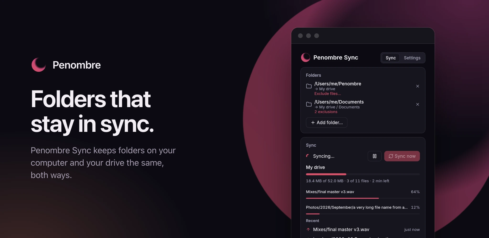

# Desktop sync



Penombre Sync is a small tray app for macOS, Linux and Windows that keeps
folders on your computer in two-way sync with Penombre. It is built on
[WebDAV and rclone](webdav.md): it does the setup that page describes for you,
then runs the sync on its own.

## What it does

- **Several folders, each to its own place.** Pair any local folder with your
  drive, a shared drive or a volume, whole or one folder in it: `~/Penombre`
  with all of My drive, `~/Documents` with `My drive / Documents`. A folder
  synced by one pair is left out of any pair containing it, so nothing downloads
  twice. Removing a pair stops syncing it; nothing is deleted.
- **Browser sign-in.** Enter your server's address; your browser opens Penombre,
  you check the code matches and approve. The app then creates its own
  [API key](webdav.md#signing-in), named after your computer, and keeps it in
  the system credential store (Keychain, Credential Manager or Secret Service).
  Your password never reaches it. **Sign out** forgets the key on this computer;
  revoke it under **Settings → API keys** to cut the device off.
- **rclone bisync underneath.** Each pair is an `rclone bisync` run, at start,
  every few minutes, on **Sync now** and shortly after local changes settle. The
  key reaches rclone through its environment only, never a configuration file.
- **Junk stays local.** `.DS_Store`, `._*`, `Thumbs.db`, `desktop.ini` and
  similar system files are never uploaded.
- **You choose what stays out.** Under each folder, **Exclude files…** takes a
  folder picked inside it, or a pattern: `*.bak` for files anywhere,
  `node_modules/` for folders of that name anywhere, `/Renders/` for one folder
  at the top. Excluded files are left where they are, on both sides: nothing is
  deleted, they just stop syncing. Changing the list makes the next sync of that
  folder a full comparison, which takes longer once.
- **It shows what is happening.** While a folder syncs, the window shows its
  progress, the files moving and their own progress. Afterwards it lists the
  files synced recently, in which direction, and the files that failed with the
  reason.
- **Failures are retried.** A file that fails is tried again a minute later. If
  it fails again you get one notification naming it; you are not told again
  until it has synced and broken anew. A folder pair that fails before any file
  does (a refused key, a rate limit, a missing folder) notifies the same way:
  once, on its second failed sync in a row.
- **It notices when the server is gone.** Before each sync the app checks the
  server answers. If it doesn't, nothing is synced, a banner says since when and
  why, and the app asks again every 30 seconds, syncing as soon as the server is
  back; **Retry now** asks at once. An outage lasting past the second check
  sends one notification; a server restarting in a few seconds does not.
- **Pause.** **Pause syncing**, in the tray menu or the window, stops syncing
  and interrupts a sync in progress. The app remembers it across restarts;
  **Resume syncing** catches up at once with what changed meanwhile.

Closing the window keeps the app in the tray; quit from the tray menu. Only one
copy runs at a time: opening it again brings the running one forward.

## Settings

The **Settings** view, beside **Sync** at the top of the window, holds:

- **Account.** The server, the key's name, **Sign out**, and **Change server**,
  which signs out and signs in to another one.
- **Start at login.** A switch, using the system's own mechanism (a login item
  on macOS, a startup entry on Linux, the registry on Windows). When
  `brew services` already starts the app it says so and stays locked, so two
  copies never run; `brew services stop penombre-sync` hands it back.
- **Updates.** The version running and its release channel: **Stable** for
  releases, **Canary** for every merge before it ships (and the stable releases
  after them). The app checks GitHub every six hours and when the channel
  changes, and notifies once per new version. **Install and restart** downloads
  that version for your system, checks it against its published SHA-256,
  replaces the app in place and relaunches it; the folder holding the app must
  be writable by you. A Homebrew install is updated by Homebrew instead, and the
  card shows the `brew` command. It starts on the channel it was released on,
  and a build from source never checks.
- **Permissions.** Whether notifications can be shown, whether each synced
  folder can be read, where rclone is, and whether the key can be read from the
  credential store, each with a button to the right system setting when one
  exists. macOS protects Documents, Desktop and Downloads: syncing one needs
  access under **Privacy & Security → Files and Folders** or **Full Disk
  Access**.

On macOS the app is a plain program, not an `.app`, so it cannot ask for
notification permission or have its own entry in **System Settings →
Notifications**. Its notifications are shown by Script Editor; allow those.

## Good to know

- A folder, or the place it syncs to, must not be completely empty: rclone
  refuses to sync against an empty side, to protect you from a wipe.
- A file that keeps failing makes each later sync of its folder a full
  comparison until it goes through. Fix the cause, a file too large for your
  reverse proxy for example (see [Reverse proxy](reverse-proxy.md)), and it
  settles.
- Folders sync one after another, so a large one delays the next.
- A folder copied or mirrored off a Penombre server (Syncthing, for example) can
  hold the server's own `.versions`, `.thumbnails` and `.tmp` folders. They are
  never synced: they mean nothing to another server. File versions do not carry
  over between servers.

## Requirements

- A Penombre server reachable over HTTPS (or plain HTTP on your own network).
- [rclone](https://rclone.org/install/). The app does not bundle it; Homebrew
  installs it for you.

## Get it from your server

**Get the apps** in your profile menu (top right) offers the build that matches
the server's own version (a canary server offers the canary build), picks your
system, shows the Homebrew command, and has the server address to paste into the
app.

## Install with Homebrew

On macOS (Apple silicon or Intel) and Linux (x86_64):

```bash
brew install orochibraru/tap/penombre-sync
brew services start penombre-sync
```

`brew services start` launches it now and at every login. Quit it from the tray
and it stays quit until the next login; if it crashes it is restarted. Its log
is `$(brew --prefix)/var/log/penombre-sync.log`. `brew upgrade` brings each new
stable release.

Canary builds are their own formula, updated on every merge:

```bash
brew install orochibraru/tap/penombre-sync-canary
brew services start penombre-sync-canary
```

The two conflict: uninstall one before installing the other. Switching the
channel in **Settings** shows the exact command.

## Download

Every Penombre release on
[GitHub](https://github.com/orochibraru/penombre/releases) carries the app, with
a `.sha256` checksum beside each file:

| System                | Download                                   |
| --------------------- | ------------------------------------------ |
| macOS, Apple silicon  | `penombre-sync-aarch64-apple-darwin.dmg`   |
| macOS, Intel          | `penombre-sync-x86_64-apple-darwin.dmg`    |
| Linux, x86_64 (glibc) | `penombre-sync-x86_64.AppImage`            |
| Windows, x86_64       | `penombre-sync-x86_64-pc-windows-msvc.exe` |

Stable releases are `vX.Y.Z`; `vX.Y.Z-canary.N` pre-releases carry every merge
before it ships. On macOS, open the `.dmg` and drag **Penombre Sync** to
**Applications**. On Linux, make the AppImage executable
(`chmod +x penombre-sync-x86_64.AppImage`) and run it. On Windows, run the
`.exe`. Each updates itself in place from **Settings**. rclone must be on your
`PATH` in every case.

The same releases also carry plain archives (`.tar.gz`, `.zip` on Windows)
holding the bare binary, which is what the in-app updater and Homebrew use.

The builds are not signed. On macOS, the first launch is refused: open **System
Settings → Privacy & Security** and choose **Open Anyway**, or clear the
quarantine flag:

```bash
xattr -dr com.apple.quarantine "/Applications/Penombre Sync.app"
```

Windows SmartScreen asks once; choose **More info → Run anyway**.

On Linux the tray needs a StatusNotifier host (KDE, and GNOME with the
AppIndicator extension), and the key store needs a Secret Service provider such
as GNOME Keyring or KWallet.

## Build from source

You need Rust 1.98 or newer ([rustup](https://rustup.rs)) and a C toolchain: the
Xcode command-line tools on macOS, the MSVC build tools on Windows, `gcc` on
Linux. Linux needs no other development package: X11, Wayland and OpenGL are
loaded at run time, and D-Bus is spoken in Rust.

```bash
git clone https://github.com/orochibraru/penombre.git
cd penombre/desktop
cargo build --release --locked
```

The binary lands in `desktop/target/release/penombre-sync` (`penombre-sync.exe`
on Windows). A source build reports the version in `desktop/Cargo.toml`; release
builds carry the release's own.
