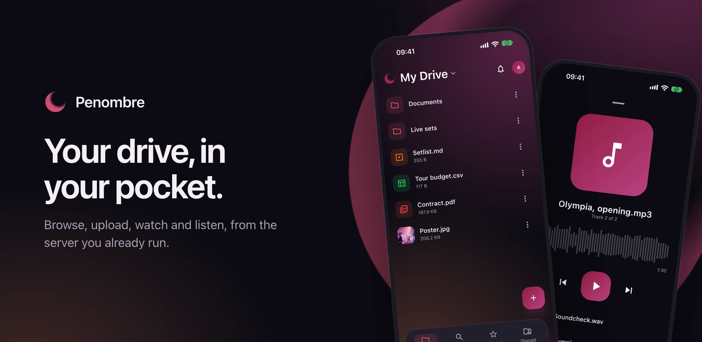

# Mobile app

The Penombre app for Android and iOS is at an early stage: it signs in, browses
your drive and shared drives, shows pictures, plays music and video, and opens
the rest in the instance's own web interface. Google Play lists it for testers
only for now; everyone else installs it from GitHub.

## Getting the app

In the web interface, open your profile menu (top right) and choose **Get the
apps**: it links the builds that match your server's version. On a phone's
browser a banner offers the same, once per session. The files are attached to
every [release](https://github.com/orochibraru/penombre/releases):

- **Android**: `penombre-android.apk`. Open it on the phone and allow your
  browser to install apps when Android asks. Each release installs over the
  last, keeping you signed in.
- **iPhone and iPad**: `penombre-ios-unsigned.ipa`. It is not signed, which iOS
  requires, so it has to go through a tool that signs it with your own Apple
  account, such as AltStore. A free account's signature lasts a week.

`penombre-android.aab` is the same app as the bundle the Play Store takes.

**Connect the mobile app** (below) links the same places for a phone that does
not have the app yet: **Get it on Google Play** (hidden on an iPhone) and **Get
it from GitHub**, which opens the release matching your server.

## Signing in

**Scan the code.** In the web interface, open your profile menu (top right),
choose **Get the apps**, then **Connect the mobile app**: it shows a QR code. In
the app, tap **Scan the code** and point the phone at it, or scan it with the
phone's own camera, which opens the app. The app asks **Sign in to
`<your server>`?**; tap **Connect** and you are in, as the account that showed
the code. There is no address to type and nothing to sign in to again.

Opened on the phone itself, which cannot scan its own screen, the dialog also
shows **Open in the app on this device**: it opens the app with the code already
in it, and the app asks the same question.

The code works once and is replaced every two minutes. Anyone who scans it while
it is on screen is signed in as you, so show it only to your own phone.

**Or type the address.** **Enter the server address instead** reveals the
address field. Tap **Sign in**: your phone's browser opens Penombre, you sign in
the way you usually do (passkeys and OAuth included, since it is the real
browser), and approve **Sign in Penombre on your phone**. The browser hands the
app a one-time code and closes. A device with no camera starts here.

**Or have a code mailed.** Where the administrator allows signing in with an
emailed code (see [sign-in methods](authentication.md)), **Email me a code**
under the address field asks for your email address and sends a code there; type
it in and you are in, with no browser. An account with two-factor authentication
is then asked for the code from its authenticator app, or one of its backup
codes. A server that does not allow emailed codes says so, and the browser
sign-in above still works.

Every way, the app holds an ordinary session, the same kind a browser gets. It
shows under **Account → Sessions** as `Penombre mobile · <model>`; revoking it
there signs the phone out on its next request. **Sign out** in the app revokes
it too.

The server needs no configuration for this. Instances older than the release
that added the app answer the sign-in page with a 404: update the server.

## What it does today

A bottom bar, present on every screen:

- **Home**: your drive, folders natively, with paging for large folders. Its
  title is a menu: tap **My Drive** to switch to **Recent**, **Starred**,
  **Trash**, a shared drive, a mounted volume, something shared with you, or a
  category (Music, Documents, Images and so on). Tapping **Home** again returns
  to your own drive's root.
- **Search**: files and folders by name, everywhere you have access. The page
  shows the search field and your recent searches, kept on the phone. From two
  letters on, results come as you type, in place of the recent searches; the
  last ones stay on screen until the next are in. Searching from the keyboard
  opens the results on their own page, and **Back** returns to the field as you
  left it; opening a result or searching keeps it among the recent ones, and a
  tap on one runs it again. Tap **Search** in the bar once more to bring up the
  keyboard.
- **Starred**: the same list as on the web.
- **Shared**: **My links** (the public links you made, to copy or revoke),
  **Shared with me**, and your shared drives, each with its own trash. **New
  shared drive** creates one.

At the top right of every tab, the bell shows your [notifications](sharing.md),
with the number unread; opening them marks them read. Your initials open
**Account**:

- **My profile**: **Account details** (name, address, downloading your files or
  your account data, deleting the account; the address shows whether it is
  verified, and is verified or changed with emailed codes, as on the web),
  **Security** (password, the sign-in method offered first, two-factor
  authentication, passkeys and API keys), **Sessions** (every device signed in,
  each one a tap from signed out) and **Activity**.
- **Settings**: **General** (language, and where each kind of notification
  reaches you: in the app, by email, on your phone), **Appearance** (light or
  dark, accent, font, corners, how files are sorted, and the web interface's
  layout options) and **Storage** (what your drive holds, by kind, and the
  server's disk).
- **Sign out**, and the app's version.

Everything the web interface's settings pages hold can be changed from the app,
except **adding a passkey**, which opens the Security page in your browser: a
passkey belongs to the server's web address and not to an app.

The accent, font and corners are your account's, so a change in the app shows on
the web and the other way round. Light or dark is this phone's own choice.

### Language

The app speaks the web interface's thirteen languages. **Settings → General →
Language** lists them, each in its own name, under **Automatic (phone's
language)**, which follows the phone and falls back to English for a language
Penombre does not have. A choice takes effect at once, without restarting the
app, and is saved to your account, so the web interface follows it too, and the
other way round: a language picked on the web is the app's the next time it
opens. The web pages the app shows (an editor, a folder opened from a search)
open in the same language. On iOS the system's own sheets and prompts follow it
from the next launch.

### Notifications on the phone

**Settings → General → On this phone** has the app check for new notifications
now and then while it is closed and show them as the phone's own. Android checks
about every fifteen minutes; iOS decides when, depending on how often the app is
used. The first time, the phone asks whether the app may notify you. Nothing is
sent through Google or Apple: the phone asks your server directly, which is why
it is not instant. The grid under it chooses, for each kind of notification
(comments and notes, shares, signatures), whether it reaches the phone at all;
it is the same grid as the web's [notification settings](notifications.md), and
the phone only shows what also stays in the app's bell.

Pull any list down to load it again.

The **+** button on **Home** and in a shared drive adds to the folder on screen:
**Choose files** from the device or another app, **Take a photo**, or **Scan a
document**, which uploads the pages as one PDF. A phone without a camera is
offered files only, and scanning on Android needs Google Play services. Files
over 200 MB are refused for now.

**New folder** is in the same menu. **Search** looks by name everywhere you have
access: your drive, every shared drive and every mounted volume. Each result
names the place and folder it is in.

The three dots on a row offer what the web interface's right-click does:
**Download** (into Downloads on Android, through the share sheet on iOS),
**Versions** (playing, downloading or restoring one), **Star**, **Rename**,
**Move to…**, **Duplicate**, **Copy to…** another folder or a shared drive, and
**Move to trash**. On a drive you can only read, the ones that change it are
absent.

### Opening a file

Tapping a file opens a preview in a drawer at the bottom of the screen:

- **A picture** shows there; **Full screen** opens the viewer, where you swipe
  between the folder's pictures and pinch or double-tap to zoom. Pictures
  [load in steps](media.md#pictures-load-in-steps): a preview first, and
  **Original** in the viewer fetches the file itself.
- **A video** starts playing in the drawer, with play and pause, ten seconds
  back or forward and a scrubber. **Full screen** carries on from the same
  moment; there the controls fade while it plays and a tap brings them back.
  Played to its end, **Play** starts it over. The label at the end of the
  scrubber is the [quality](media.md#video-quality): tap it for **720p** or
  **480p** on a slow connection.
- **A video the phone cannot play** (an AVI, for one) says so instead of showing
  a black screen, and **Convert and play** has the server render a version that
  does.
- **A PDF** shows its first page; **Open** shows every page, scrolling, with
  pinch to zoom.
- **A document, sheet, deck or Office file** opens in the web app's
  [editor](documents.md).
- **Any other file** shows its thumbnail when the server has one, and **Open**
  shows the raw file.

A track with earlier versions shows its version number beside its duration,
**v3** for the third. Tap it for the list, where each version plays like any
track.

A track does not open a drawer: it starts playing in the mini player above the
bottom bar, along with the folder's other tracks. Tap the mini player, or slide
it up, for the full player: waveform scrubber, previous and next, and the queue.
Playback continues while you browse. A video takes over from a track.

A folder opened from **Recent**, **Starred** or a category opens in the web
interface. Everything the web interface shows inside the app is already signed
in.

## Plain HTTP

The app allows plain `http://` addresses, since a self-hosted instance is often
reached on a LAN before it has a certificate. Passkeys still need the domain
they were created on: a passkey made for `https://files.example.com` cannot sign
in to `http://192.168.1.20:3000`.
