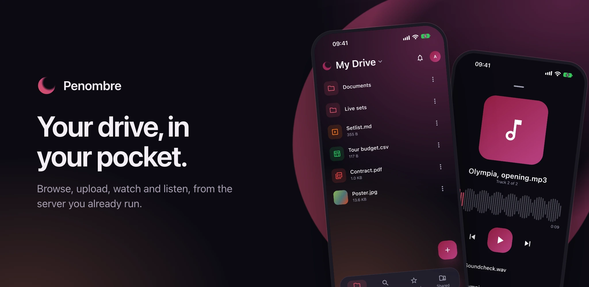

# Mobile app

The Penombre app for Android and iOS is at an early stage: it signs in, browses
your drive and shared drives, shows pictures, plays music and video, and opens
the rest in the instance's own web interface. It is not in the app stores yet.

## Getting the app

In the web interface, open your profile menu (top right) and choose **Get the
apps**: it links the builds that match your server's version. On a phone's
browser a banner offers the same, once per session. The files are attached to
every [release](https://github.com/orochibraru/penombre/releases):

- **Android**: `penombre-android.apk`. Open it on the phone and allow your
  browser to install apps when Android asks. Each release installs over the
  last, keeping you signed in.
- **iPhone and iPad**: `penombre-ios-unsigned.ipa`. It is not signed, which iOS
  requires, so it has to go through a tool that signs it with your own Apple
  account, such as AltStore. A free account's signature lasts a week.

`penombre-android.aab` is the same app as the bundle the Play Store takes.

## Signing in

**Scan the code.** In the web interface, open your profile menu (top right),
choose **Get the apps**, then **Connect the mobile app**: it shows a QR code. In
the app, tap **Scan the code** and point the phone at it, or scan it with the
phone's own camera, which opens the app. The app asks **Sign in to
`<your server>`?**; tap **Connect** and you are in, as the account that showed
the code. There is no address to type and nothing to sign in to again.

The code works once and is replaced every two minutes. Anyone who scans it while
it is on screen is signed in as you, so show it only to your own phone.

**Or type the address.** **Enter the server address instead** reveals the
address field. Tap **Sign in**: your phone's browser opens Penombre, you sign in
the way you usually do (passkeys and OAuth included, since it is the real
browser), and approve **Sign in Penombre on your phone**. The browser hands the
app a one-time code and closes. A device with no camera starts here.

Either way the app holds an ordinary session, the same kind a browser gets. It
shows under **Account → Sessions** as `Penombre mobile · <model>`; revoking it
there signs the phone out on its next request. **Sign out** in the app revokes
it too.

The server needs no configuration for this. Instances older than the release
that added the app answer the sign-in page with a 404: update the server.

## What it does today

A bottom bar with the web app's four entries, present on every screen:

- **Home**: your drive, folders natively, with paging for large folders. Tapping
  **Home** again returns to the drive's root.
- **Recent** and **Starred**: the same lists as on the web.
- **Menu**: your account and server, **Shared drives**, **Trash**, **Settings**
  (the accent colour), **Shared with me** and **Open web app**, which open in
  the web interface, and **Sign out**.

Pull any list down to load it again.

The **+** button on **Home** and in a shared drive adds to the folder on screen:
**Choose files** from the device or another app, **Take a photo**, or **Scan a
document**, which uploads the pages as one PDF. A phone without a camera is
offered files only, and scanning on Android needs Google Play services. Files
over 200 MB are refused for now.

**New folder** is in the same menu, and the magnifying glass in the header
searches by name everywhere you have access: your drive, every shared drive and
every mounted volume. Each result names the place and folder it is in.

The three dots on a row offer what the web interface's right-click does:
**Download** (into Downloads on Android, through the share sheet on iOS),
**Versions** (playing, downloading or restoring one), **Star**, **Rename**,
**Move to…**, **Duplicate**, **Copy to…** another folder or a shared drive, and
**Move to trash**. On a drive you can only read, the ones that change it are
absent.

### Opening a file

Tapping a file opens a preview in a drawer at the bottom of the screen:

- **A picture** shows there; **Full screen** opens the viewer, where you swipe
  between the folder's pictures and pinch or double-tap to zoom. Pictures
  [load in steps](media.md#pictures-load-in-steps): a preview first, and
  **Original** in the viewer fetches the file itself.
- **A video** starts playing in the drawer, with play and pause, ten seconds
  back or forward and a scrubber. **Full screen** carries on from the same
  moment; there the controls fade while it plays and a tap brings them back.
  Played to its end, **Play** starts it over. The label at the end of the
  scrubber is the [quality](media.md#video-quality): tap it for **720p** or
  **480p** on a slow connection.
- **A video the phone cannot play** (an AVI, for one) says so instead of showing
  a black screen, and **Convert and play** has the server render a version that
  does.
- **A PDF** shows its first page; **Open** shows every page, scrolling, with
  pinch to zoom.
- **A document, sheet, deck or Office file** opens in the web app's
  [editor](documents.md).
- **Any other file** shows its thumbnail when the server has one, and **Open**
  shows the raw file.

A track with earlier versions shows its version number beside its duration,
**v3** for the third. Tap it for the list, where each version plays like any
track.

A track does not open a drawer: it starts playing in the mini player above the
bottom bar, along with the folder's other tracks. Tap the mini player, or slide
it up, for the full player: waveform scrubber, previous and next, and the queue.
Playback continues while you browse. A video takes over from a track.

A folder opened from **Recent** or **Starred** opens in the web interface.
Everything the web interface shows inside the app is already signed in.

## Plain HTTP

The app allows plain `http://` addresses, since a self-hosted instance is often
reached on a LAN before it has a certificate. Passkeys still need the domain
they were created on: a passkey made for `https://files.example.com` cannot sign
in to `http://192.168.1.20:3000`.
